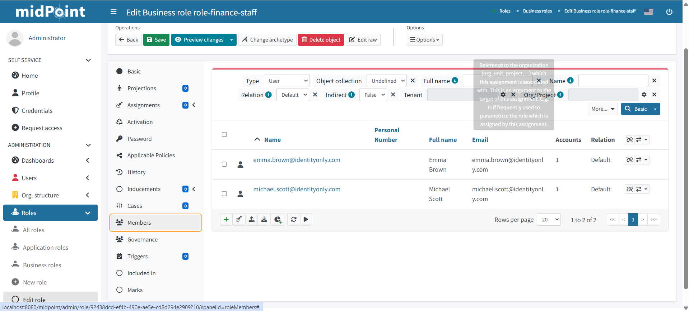
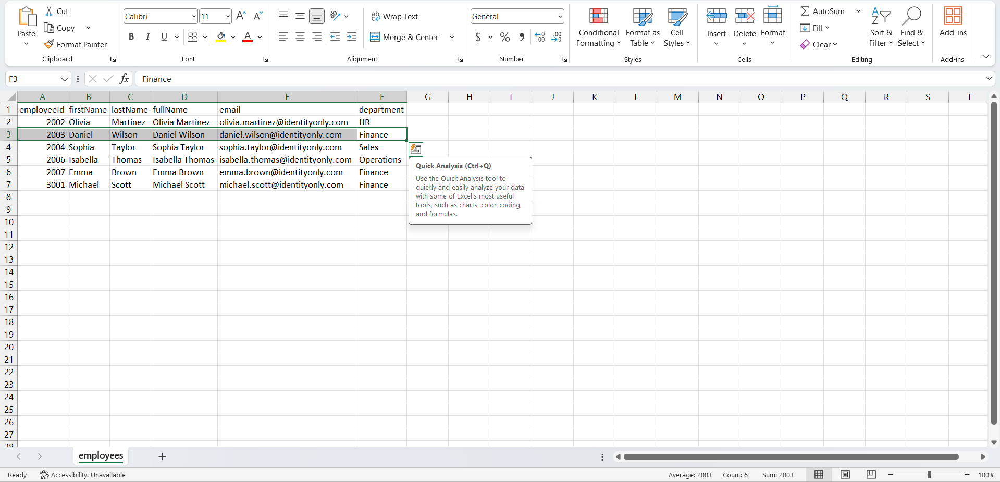
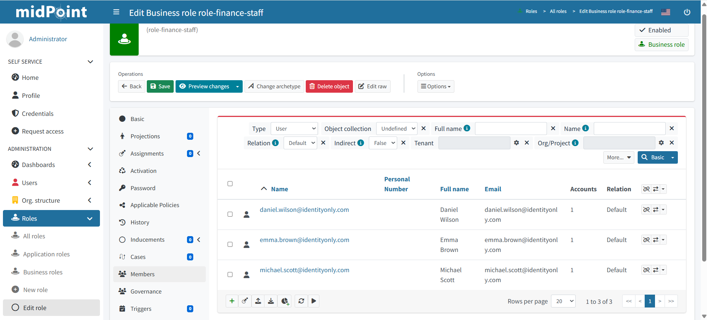

# IAM Lab 03 — RBAC Automation using midPoint

# Lab Overview

This lab focused on implementing Role-Based Access Control (RBAC) automation using midPoint integrated with an HR authoritative source.

The objective of this lab was to understand how IAM platforms automate:

- role assignment based on HR department attributes
- dynamic role updates when employees change departments
- policy-driven access governance without manual intervention
- business role management aligned to organisational structure

The HR system was simulated using a CSV file, similar to how enterprise organisations integrate IAM platforms with:

- Workday
- SAP SuccessFactors
- Oracle HCM

midPoint was used as the Identity Governance and Administration (IGA) platform responsible for:

- object template policy enforcement
- automated role assignment
- role lifecycle management
- RBAC governance processing

---

# Technologies Used

- midPoint
- Docker
- PostgreSQL
- CSV Connector
- Object Templates
- Business Roles
- Assignment Mappings

---

# Enterprise IAM Architecture Simulated

HR CSV File  
→ midPoint Synchronization Engine  
→ Object Template Policy Evaluation  
→ Automated Role Assignment  
→ RBAC Governance

---

# Lab Objectives

This lab simulated:

| Objective | Description |
|---|---|
| RBAC Auto-Assignment | Roles assigned automatically based on HR department |
| Role Hierarchy | Business roles aligned to organisational departments |
| Mover Role Update | Role changes automatically when department changes |
| Policy-Driven Governance | No manual role assignment required |

---

# HR Authoritative Source

The HR CSV file contained the following employees across four departments:

| Employee | Department |
|---|---|
| James Anderson | Finance |
| Olivia Martinez | HR |
| Daniel Wilson | Sales |
| Sophia Taylor | Sales |
| Isabella Thomas | Operations |
| Emma Brown | Finance |
| Michael Scott | Finance |

---

# Business Roles Created

Four business roles were created in midPoint aligned to the department structure in the HR source:

| Role Name | Department |
|---|---|
| role-finance-staff | Finance |
| role-hr-staff | HR |
| role-sales-staff | Sales |
| role-operations-staff | Operations |

Business roles were used rather than application roles because they represent job-function access packages — this reflects enterprise RBAC design where business roles bundle entitlements by organisational function.

---

# Why an Object Template Was Required

Role assignment in midPoint does not happen automatically unless a policy is defined.

An Object Template was created to enforce assignment policy across all user objects.

The object template:
- evaluates HR attributes on every user recompute
- applies assignment mappings based on the `locality` field (which stores the department value from the HR CSV)
- automatically assigns the correct business role
- removes roles that no longer apply when attributes change

Without an object template:
- roles would need to be assigned manually
- department changes would not trigger role updates
- governance automation could not function

---

# Object Template Configuration

The object template used an assignment mapping with a Groovy script condition to evaluate the department value and return the matching role name:

```groovy
if (locality == 'Finance') return 'role-finance-staff'
else if (locality == 'HR') return 'role-hr-staff'
else if (locality == 'Sales') return 'role-sales-staff'
else if (locality == 'Operations') return 'role-operations-staff'
else return null
```

The mapping used `assignmentTargetSearch` to locate the role by name and assign it dynamically.

---

# System Configuration — Linking Object Template to UserType

After creating the object template, it was linked to the UserType in midPoint's System Configuration.

This ensured that the policy applied globally to all user objects — not just individually selected users.

```xml
<defaultObjectPolicyConfiguration>
    <type>UserType</type>
    <objectTemplateRef oid="f4345681-7d36-4adf-88e5-4fd22a46d8ec"
                       type="ObjectTemplateType"/>
</defaultObjectPolicyConfiguration>
```

Without this step, the object template exists but is never applied.

---

# RBAC Auto-Assignment Result

After recomputing users, each identity was automatically assigned the correct business role based on their HR department attribute.



| Employee | Department | Role Assigned |
|---|---|---|
| James Anderson | Finance | role-finance-staff ✅ |
| Olivia Martinez | HR | role-hr-staff ✅ |
| Daniel Wilson | Sales | role-sales-staff ✅ |
| Sophia Taylor | Sales | role-sales-staff ✅ |
| Isabella Thomas | Operations | role-operations-staff ✅ |
| Emma Brown | Finance | role-finance-staff ✅ |
| Michael Scott | Finance | role-finance-staff ✅ |

---

# Mover Lifecycle — Role Update Demonstration

## Existing Department and Role

Daniel Wilson initially existed in midPoint with:
- Department: Sales
- Role: role-sales-staff

## Department Changed in HR CSV

The HR authoritative source was updated to change Daniel Wilson's department from:
- Sales → Finance

This simulated an enterprise Mover lifecycle event.



## Role Automatically Updated in midPoint

After reconciliation:
- role-sales-staff was automatically **removed**
- role-finance-staff was automatically **assigned**



This validated:
- policy-driven role lifecycle management
- automated role removal on department change
- Mover RBAC governance

---

# Difference Between Manual and Policy-Driven RBAC

| Approach | Description |
|---|---|
| Manual Assignment | Administrator assigns roles individually — error-prone, not scalable |
| Policy-Driven RBAC | Object template evaluates HR attributes and assigns roles automatically — scalable, auditable |

This lab demonstrated policy-driven RBAC — the standard approach in enterprise IGA environments.

---

# IAM Concepts Demonstrated

- Role-Based Access Control (RBAC)
- Business Role Design
- Object Template Policy Enforcement
- Assignment Mapping
- Automated Role Assignment
- Role Lifecycle Management
- Mover RBAC Governance
- Policy-Driven Access Control
- HR-Driven Role Automation

---

# Enterprise Learning Outcome

This lab strengthened my understanding of how enterprise IAM systems automate role assignment using:
- object template policies
- HR authoritative source integration
- assignment mappings
- business role hierarchies

The lab also demonstrated the operational difference between:
- manually assigning roles
- policy-driven automated role governance

which is a critical concept in real-world Identity Governance and Administration (IGA) environments.

This RBAC automation pattern directly reflects how platforms such as SailPoint IdentityNow, Saviynt, and Microsoft Entra ID Governance implement role assignment policies driven by HR system attributes.
