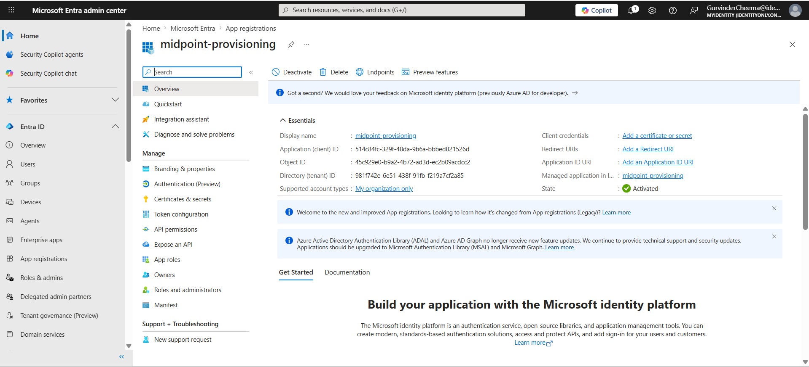
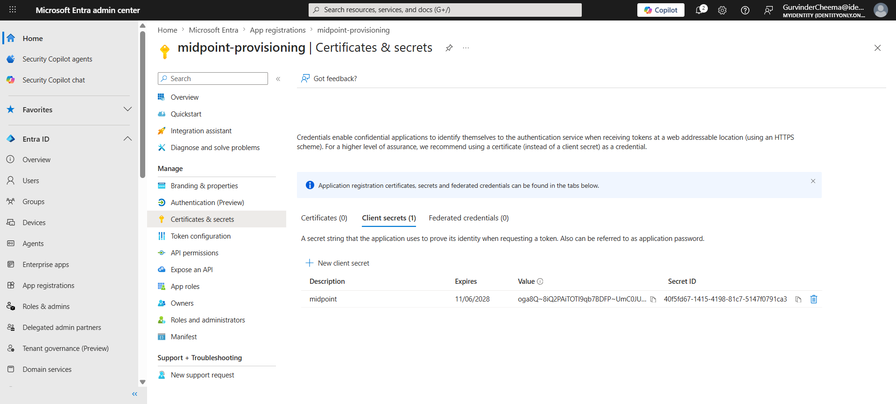
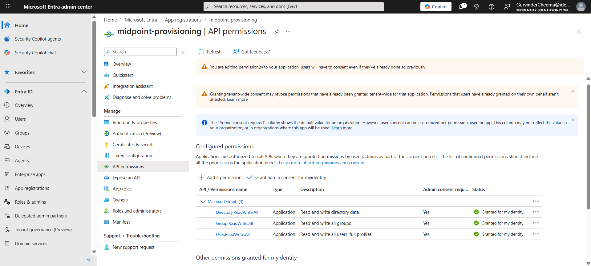
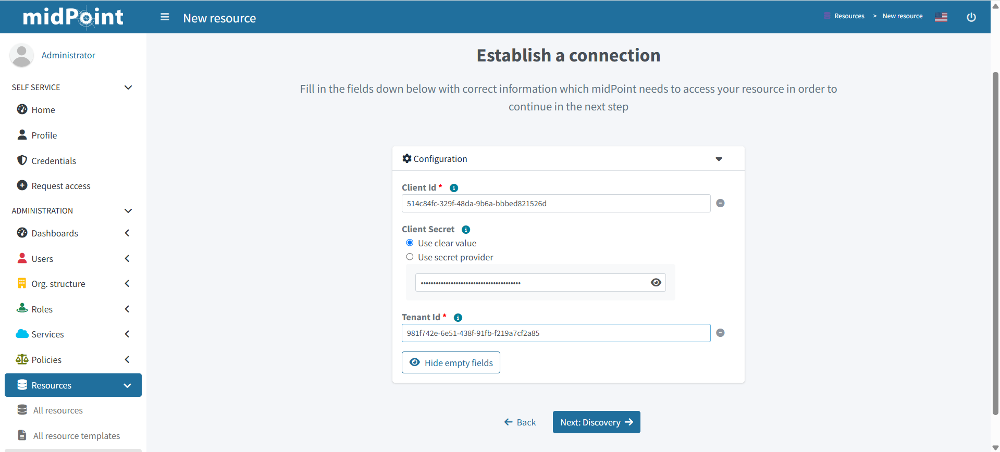
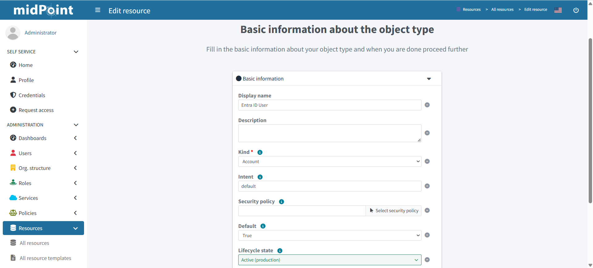
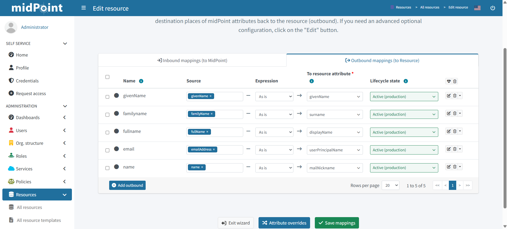
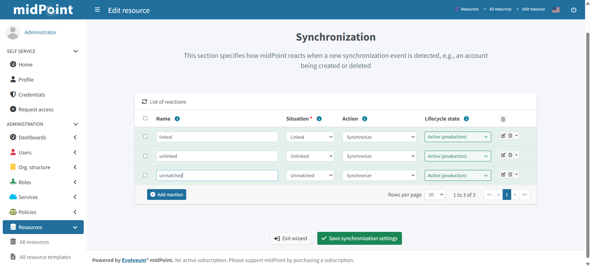
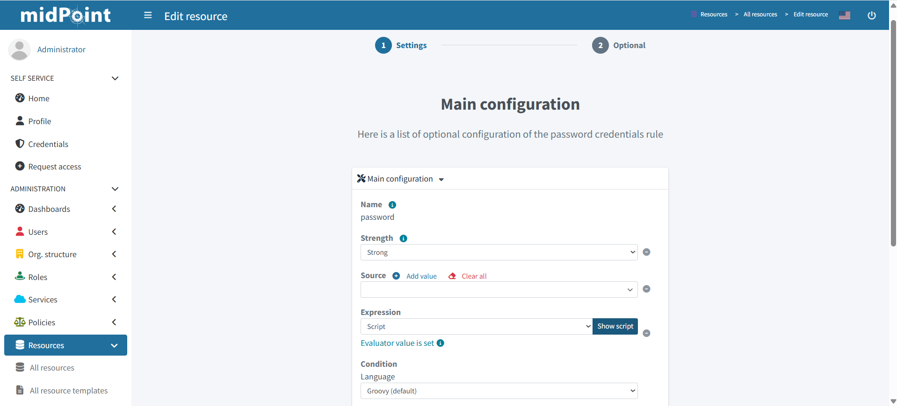
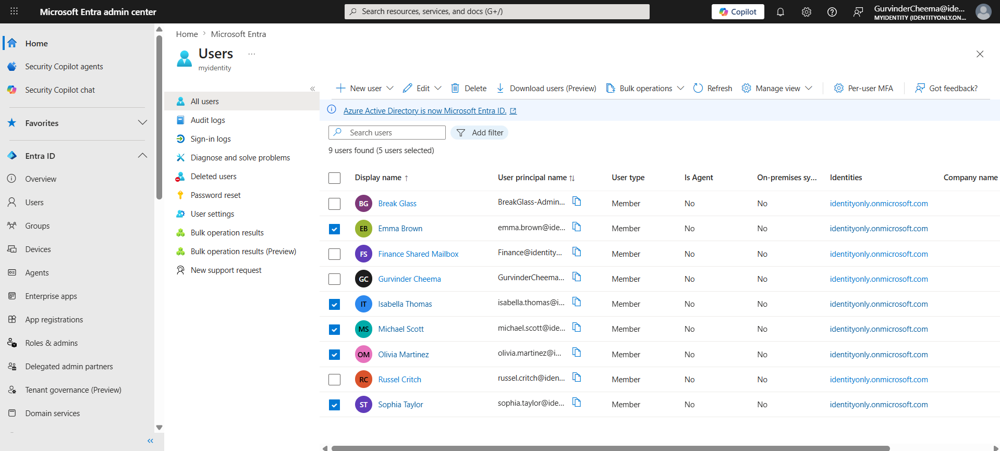

# IAM Lab 04 — HR to Cloud Identity Provisioning using midPoint and Microsoft Entra ID

# Lab Overview

This lab focused on implementing automated cloud identity provisioning using midPoint integrated with Microsoft Entra ID via the Microsoft Graph API.

The objective of this lab was to understand how IAM platforms automate:

- provisioning cloud identities from an HR authoritative source
- connecting an on-premises IGA platform to a cloud directory
- attribute mapping between HR data and cloud identity attributes
- automated account creation in Microsoft Entra ID without manual intervention

The HR system was simulated using a CSV file, similar to how enterprise organisations integrate IAM platforms with:

- Workday
- SAP SuccessFactors
- Oracle HCM

midPoint was used as the Identity Governance and Administration (IGA) platform responsible for:

- HR source synchronization
- outbound provisioning to Entra ID
- attribute transformation and mapping
- credential provisioning
- lifecycle governance

---

# Technologies Used

- midPoint
- Docker
- PostgreSQL
- CSV Connector (HR Source)
- Microsoft Graph API Connector (MSGraphConnector v1.2.0.0)
- Microsoft Entra ID
- Microsoft Azure App Registration
- OAuth 2.0 Client Credentials Flow

---

# Enterprise IAM Architecture Simulated

HR CSV File  
→ midPoint Synchronization Engine  
→ Microsoft Graph API  
→ Microsoft Entra ID  
→ Cloud Identity Created

---

# Lab Objectives

This lab simulated:

| Objective | Description |
|---|---|
| Cloud Provisioning | Users created in Entra ID automatically from HR source |
| App Registration | midPoint authenticated to Entra ID via OAuth 2.0 |
| Attribute Mapping | HR attributes mapped to Entra ID user attributes |
| Credential Provisioning | Initial password set on account creation |
| Outbound Sync | midPoint pushes identity data to cloud directory |

---

# Step 1 — Microsoft Entra ID App Registration

Before midPoint can provision to Entra ID, an App Registration must be created in Azure to grant midPoint permission to manage identities.



A new App Registration named `midpoint-provisioning` was created in Microsoft Entra ID. This registration acts as the service account midPoint uses to authenticate to the Microsoft Graph API.

The App Registration provides:
- **Application (Client) ID** — used by midPoint to identify itself
- **Directory (Tenant) ID** — used to target the correct Entra ID tenant

---

# Step 2 — Client Secret Creation



A Client Secret was created under Certificates & Secrets. This secret acts as the password midPoint uses when authenticating to Microsoft Graph API via the OAuth 2.0 Client Credentials flow.

In enterprise environments, certificate-based authentication is preferred over client secrets for production use. For this lab, a client secret was used to simulate the connection.

---

# Step 3 — API Permissions Configuration



The following Microsoft Graph API permissions were granted with Admin Consent:

| Permission | Type | Purpose |
|---|---|---|
| User.ReadWrite.All | Application | Create and manage users |
| Group.ReadWrite.All | Application | Manage group memberships |
| Directory.ReadWrite.All | Application | Full directory write access |

Application permissions (not delegated) were used because midPoint runs as a background service without a signed-in user — this reflects the Client Credentials OAuth 2.0 flow used in enterprise provisioning.

---

# Step 4 — midPoint Resource Configuration

## Why the MSGraphConnector Was Required

midPoint communicates with Entra ID through the **MSGraphConnector** — a connector that translates midPoint's provisioning operations into Microsoft Graph API calls.

The connector was installed by:
- Downloading `connector-msgraph-1.2.0.0.jar` from Evolveum Nexus
- Copying it into the midPoint connector directory inside the Docker container
- Restarting the midPoint container to load the connector

## Connection Setup



The ms-graph resource was configured in midPoint using:
- **Client ID** — from the Entra ID App Registration
- **Client Secret** — from Certificates & Secrets
- **Tenant ID** — from the Entra ID App Registration overview

midPoint successfully connected to Entra ID and discovered the resource schema automatically.

---

# Step 5 — Object Type Configuration



An object type was configured with:
- **Kind** → Account
- **Intent** → Default
- **Display Name** → Entra ID User
- **Object Class** → AccountObjectClass

This tells midPoint that when provisioning to ms-graph, it should create user accounts using the Entra ID account schema.

---

# Step 6 — Outbound Attribute Mappings



Outbound mappings were configured to push midPoint user attributes to Entra ID on account creation:

| midPoint Attribute | Entra ID Attribute | Notes |
|---|---|---|
| `givenName` | `givenName` | First name |
| `familyName` | `surname` | Last name |
| `fullName` | `displayName` | Full display name |
| `emailAddress` | `userPrincipalName` | Primary login identity |
| `emailAddress` (split) | `mailNickname` | Email prefix only (no @ symbol) |
| Script: `return true` | `accountEnabled` | Account enabled on creation |

The `mailNickname` required a Groovy script to extract only the prefix before the `@` symbol, as Entra ID rejects values containing `@`:

```groovy
if (emailAddress == null) return null
return emailAddress.split('@')[0]
```

---

# Step 7 — Synchronization Reactions



Synchronization reactions were configured to define how midPoint behaves when account states change:

| Situation | Action |
|---|---|
| Linked | Synchronize |
| Unlinked | Synchronize |
| Unmatched | Synchronize |

---

# Step 8 — Password Policy Configuration



A credential mapping was configured to set an initial password on account creation. Microsoft Entra ID enforces the following password complexity requirements:

- Minimum 8 characters
- Must contain characters from at least 3 of: uppercase, lowercase, numbers, symbols
- Must not be a commonly used password

A Groovy script expression was used to provision the initial password:

```groovy
return "Welcome@12345!"
```

In enterprise environments, passwords are typically auto-generated and delivered to users via secure channels, or users are prompted to set their own password on first login.

---

# Step 9 — Successful Provisioning to Entra ID



After configuring the resource and assigning the `role-entra-provisioning` role to users, midPoint successfully provisioned all HR users into Microsoft Entra ID.

Users provisioned:

| Employee | Email | Status |
|---|---|---|
| Olivia Martinez | olivia.martinez@identityonly.onmicrosoft.com | ✅ Provisioned |
| Daniel Wilson | daniel.wilson@identityonly.onmicrosoft.com | ✅ Provisioned |
| Sophia Taylor | sophia.taylor@identityonly.onmicrosoft.com | ✅ Provisioned |
| Isabella Thomas | isabella.thomas@identityonly.onmicrosoft.com | ✅ Provisioned |
| Emma Brown | emma.brown@identityonly.onmicrosoft.com | ✅ Provisioned |
| Michael Scott | michael.scott@identityonly.onmicrosoft.com | ✅ Provisioned |

---

# Key Technical Challenges and Resolutions

This lab involved several real-world troubleshooting scenarios:

| Challenge | Root Cause | Resolution |
|---|---|---|
| Network unreachable | Docker container had no outbound internet access | Added DNS settings to docker-compose.yml |
| Double `@@` in UPN | CSV update appended domain to existing email | Corrected emails in HR CSV and re-imported |
| Invalid mailNickname | `@` symbol not allowed in mailNickname field | Used Groovy script to extract prefix before `@` |
| Password validation failure | Entra ID complexity requirements | Used script expression with compliant password |

---

# IAM Concepts Demonstrated

- Microsoft Graph API Integration
- OAuth 2.0 Client Credentials Flow
- App Registration and Service Principal
- Outbound Identity Provisioning
- Attribute Mapping and Transformation
- Groovy Script Expressions
- Credential Provisioning
- Cloud Identity Lifecycle Management
- HR-Driven Cloud Provisioning

---

# Enterprise Learning Outcome

This lab strengthened my understanding of how enterprise IAM systems provision cloud identities using:

- Microsoft Graph API connector integration
- OAuth 2.0 service principal authentication
- Outbound attribute mapping and transformation
- HR-driven automated provisioning to cloud directories

The provisioning pattern demonstrated in this lab directly reflects how enterprise organisations integrate IGA platforms such as SailPoint IdentityNow, Saviynt, and Microsoft Entra ID Governance with cloud identity providers — where HR data drives automated identity creation across all connected systems.

Full lab documentation and config files available at:  
https://github.com/Guricheema22/iam-portfolio/tree/main/Governance
