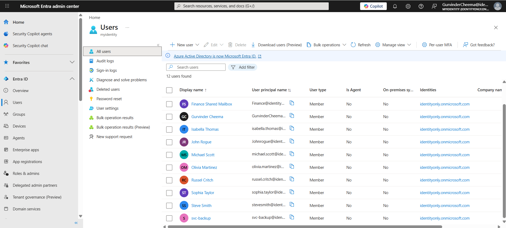
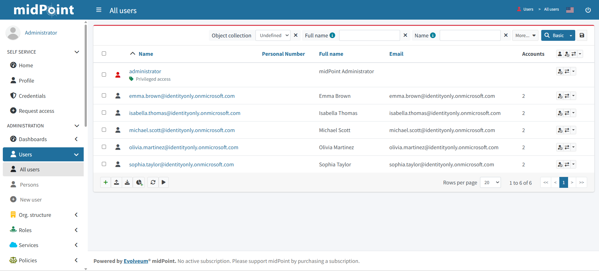
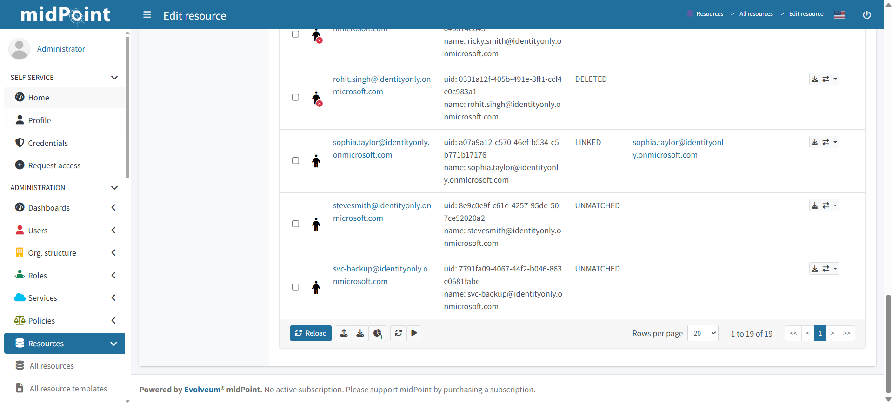
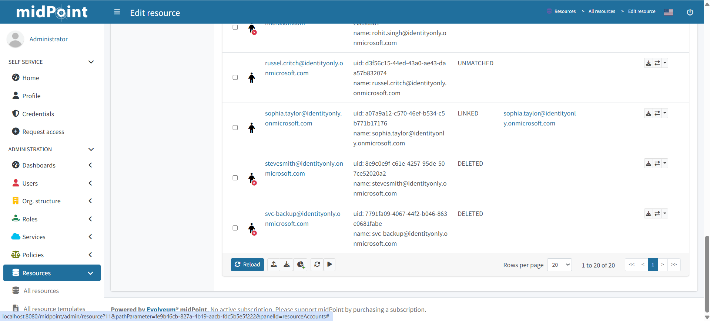

# IAM Lab 05 — Non-Human Identity (NHI) Governance and Orphaned Account Detection

# Lab Overview

This lab focused on implementing Non-Human Identity (NHI) governance using midPoint as the IGA platform and Microsoft Entra ID as the target system.

The objective of this lab was to understand how IAM platforms detect and govern:

- accounts created outside the IAM provisioning process
- service accounts with no authoritative HR source
- user accounts onboarded directly into target systems bypassing governance
- orphaned accounts with no owner, no role, and no HR record

This is one of the most common and critical governance gaps in enterprise environments. When accounts are created directly in target systems without going through the IGA platform, they become invisible to governance controls — no owner, no review cycle, no deprovisioning trigger.

The HR system was simulated using a CSV file, and midPoint was used as the Identity Governance and Administration (IGA) platform responsible for:

- reconciliation against Entra ID
- orphaned account detection
- NHI inventory documentation
- remediation workflow

---

# Technologies Used

- midPoint
- Docker
- PostgreSQL
- CSV Connector (HR Source)
- Microsoft Graph API Connector
- Microsoft Entra ID
- Reconciliation Tasks

---

# Enterprise IAM Architecture Simulated

```
HR CSV → midPoint → Microsoft Entra ID
                         ↑
              Accounts created OUTSIDE this pipeline
              become ungoverned NHI / orphan accounts
```

---

# Lab Objectives

| Objective | Description |
|---|---|
| NHI Simulation | Create service account and user directly in Entra ID, bypassing midPoint |
| Visibility Gap | Demonstrate midPoint cannot see accounts it did not provision |
| Reconciliation | Run ms-graph reconciliation to surface unmanaged accounts |
| NHI Inventory | Document discovered accounts in a structured inventory |
| Remediation | Delete accounts and confirm midPoint detects removal |

---

# What is a Non-Human Identity (NHI)?

A Non-Human Identity is any account that is not tied to a real employee in the HR system:

- Service accounts used by applications or automation scripts
- System accounts used by middleware or scheduled tasks
- Shared accounts used by multiple people
- Emergency or break glass accounts
- Accounts created by developers or sysadmins directly in target systems

NHIs are one of the highest-risk identity categories in enterprise environments because:

- They often have elevated privileges
- They are rarely reviewed or rotated
- They have no individual owner accountable for their use
- They persist long after their original purpose ends

---

# Pre-Lab — Understanding What Already Existed

Before simulating the NHI scenario, the lab environment already contained a real-world example of an unmanaged account:

`BreakGlass-Admin@identityonly.onmicrosoft.com`

This account was automatically created by Microsoft in the M365 Developer tenant as an emergency access account. It was never provisioned through midPoint and has no HR record — making it a genuine NHI that already existed in the environment before this lab began.

This confirmed the real-world reality: **unmanaged accounts already exist in most environments before IGA governance is implemented.**

---

# Step 1 — Create Accounts Directly in Entra ID (Bypassing midPoint)

Two accounts were created directly in Microsoft Entra ID without going through the HR → midPoint → Entra ID provisioning pipeline.



**Account 1 — Service Account (NHI)**

| Field | Value |
|---|---|
| Display name | svc-backup |
| User principal name | svc-backup@identityonly.onmicrosoft.com |
| Account type | Service account / NHI |
| Provisioned via midPoint | No |
| HR record exists | No |

This simulates a developer or sysadmin creating a service account directly in Entra ID to run a backup automation script — bypassing the IAM process entirely.

**Account 2 — User Account**

| Field | Value |
|---|---|
| Display name | Steve Smith |
| User principal name | steve.smith@identityonly.onmicrosoft.com |
| Account type | User account |
| Provisioned via midPoint | No |
| HR record exists | No |

This simulates an employee being onboarded directly into Entra ID without an HR record being created first — bypassing the authoritative source.

Both accounts now have active access to the Entra ID tenant. midPoint has no knowledge of either account.

---

# Step 2 — Confirm midPoint Cannot See the Accounts



Searching for `svc-backup` and `steve.smith` in midPoint returned no results.

This is the **IGA visibility gap**:

- The accounts exist in Entra ID ✅
- The accounts have active access ✅
- midPoint cannot see them ❌
- No owner is assigned ❌
- No role justifies their existence ❌
- No HR record authorises their access ❌

In a real enterprise environment, this gap is where breaches happen. Accounts exist with active access and no governance controls.

---

# Why This Happens in Enterprise Environments

This scenario is not hypothetical. It is one of the most common findings in IAM audits:

- Developers create service accounts directly in Active Directory or Entra ID
- System teams create shared accounts for monitoring tools
- IT operations create break glass accounts outside the ITSM process
- Contractors are onboarded directly into systems without HR records
- Legacy accounts remain active after the IGA platform is implemented

Without scheduled reconciliation against all target systems, the IGA platform remains blind to these accounts indefinitely.

---

# Step 3 — Run Reconciliation on ms-graph

A reconciliation task was created and run against the ms-graph resource in midPoint.

Reconciliation compares:
- Every account that exists in Entra ID (discovered via Microsoft Graph API)
- Every account that midPoint provisioned and tracks

Accounts found in Entra ID but not in midPoint are surfaced as **UNMATCHED** — they exist in the target system but have no authoritative source in the IGA platform.

---

# Step 4 — Review Discovered Unmatched Accounts



After reconciliation, filtering the ms-graph Accounts tab by **Situation: Unmatched** revealed all accounts that exist in Entra ID but were never provisioned by midPoint:

| Account | Situation | HR Record | Owner | Risk Level |
|---|---|---|---|---|
| svc-backup@identityonly.onmicrosoft.com | UNMATCHED | ❌ None | ❌ None | High |
| steve.smith@identityonly.onmicrosoft.com | UNMATCHED | ❌ None | ❌ None | High |
| BreakGlass-Admin@identityonly.onmicrosoft.com | UNMATCHED | ❌ None | ❌ None | High |

This is exactly what enterprise IGA teams see when they run their first reconciliation against a legacy environment — dozens or hundreds of unmatched accounts, each one a potential security risk with no clear owner.

---

# Governed vs Ungoverned Identity — The Contrast

| Attribute | Emma Brown (Governed) | svc-backup (Ungoverned) |
|---|---|---|
| HR Record | ✅ Yes | ❌ No |
| midPoint user | ✅ Yes | ❌ No |
| Entra ID account | ✅ Yes | ✅ Yes |
| Owner in IGA | ✅ Yes | ❌ No |
| Role assigned | ✅ Yes | ❌ No |
| Department known | ✅ Finance | ❌ Unknown |
| Deprovisioning trigger | ✅ HR termination | ❌ Never |
| Fully governed | ✅ Yes | ❌ No |

Emma Brown was provisioned through the HR → midPoint → Entra ID pipeline. Her identity has an authoritative source, an owner, a role, and a deprovisioning trigger. If she leaves the organisation, her Entra ID account will be disabled automatically.

svc-backup has none of these controls. It will persist indefinitely unless manually discovered and removed.

---

# NHI Inventory

For every unmanaged account discovered, an NHI inventory entry was created:

**svc-backup**

| Field | Value |
|---|---|
| Account | svc-backup@identityonly.onmicrosoft.com |
| Account Type | Service Account / NHI |
| Provisioned via midPoint | No |
| HR Record exists | No |
| Owner documented | No |
| Situation in midPoint | UNMATCHED |
| Follows least privilege | Unknown |
| Has expiry date | No |
| Risk Level | High |
| If compromised | Unauthorized automated access to tenant with no audit trail |

**steve.smith**

| Field | Value |
|---|---|
| Account | steve.smith@identityonly.onmicrosoft.com |
| Account Type | User Account |
| Provisioned via midPoint | No |
| HR Record exists | No |
| Owner documented | No |
| Situation in midPoint | UNMATCHED |
| Follows least privilege | Unknown |
| Has expiry date | No |
| Risk Level | High |
| If compromised | Persistent unauthorized user access with no governance controls |

---

# Remediation Options

For each unmatched account discovered, an IGA team has three options:

| Option | Action | When to Use |
|---|---|---|
| **Adopt** | Create HR record, link to midPoint, assign role and owner | Account is legitimate but was created outside the governance process |
| **Investigate** | Raise access review ticket, assign temporary owner | Account origin is unknown and needs investigation before action |
| **Decommission** | Disable in Entra ID, delete after review period | Account has no business justification and should be removed |

For this lab, both accounts were decommissioned as they had no legitimate business purpose.

---

# Step 5 — Cleanup and Verification

Both `svc-backup` and `steve.smith` were deleted directly from Microsoft Entra ID. A second reconciliation task was run on the ms-graph resource.



After reconciliation, both accounts showed as **DELETED** in midPoint's Accounts tab — confirming that midPoint detected their removal from Entra ID and updated its records accordingly.

This validated the full NHI governance lifecycle:

```
Account created outside governance
    → IGA platform blind to it
        → Reconciliation surfaces it as UNMATCHED
            → Investigation and remediation
                → Account deleted from Entra ID
                    → Reconciliation confirms DELETED
                        → Governance cycle complete
```

---

# IAM Concepts Demonstrated

- Non-Human Identity (NHI) Governance
- IGA Visibility Gap
- Orphaned Account Detection
- Reconciliation-Driven Discovery
- Unmatched Account Triage
- NHI Inventory Management
- Governed vs Ungoverned Identity Contrast
- Remediation Lifecycle
- Microsoft Entra ID Reconciliation via Graph API

---

# Enterprise Learning Outcome

This lab strengthened my understanding of how enterprise IAM teams govern identities that exist outside the official provisioning process using:

- scheduled reconciliation against all target systems
- unmatched account detection and triage
- NHI inventory documentation
- remediation workflows for orphaned accounts.
